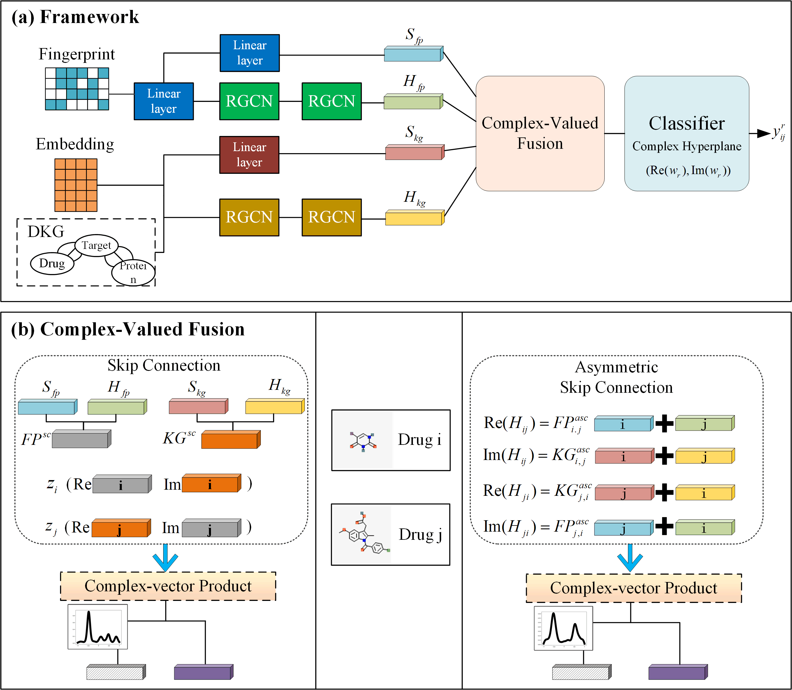

# DMCF-DDI: a dual-modality complex-valued fusion method for predicting side effect of drug–drug interactions based on graph neural network
## Overview
This repository contains codes necessary to run the DMCF-DDI algorithm.

## Framework

(a) An overall architecture of DMCF-DDI. The fingerprint matrix and drug knowledge graph with initial embedding are the inputs of two modalities, respectively.
GCN-encoder learns the two semanti c-level features of each modality with two-layer RGCN. 
Then, the fine-grained drug pair representations (DPRs) are obtained by complex-valued fusion. 
Finally, the probability $y_{ij}^r$ of the drug pair having the side effect $r$ is predicted using a classifier based on the complex hyperplane $(Re(w_r),Im(w_r))$.
(b) Complex-valued fusion.
Skip connection integrates the output of RGCN-encoders $H_{fp}$ with the initial modal features $S_{fp}$ through addition. 
Modal features represent the real and imaginary parts of drug complex features $z_i$ and $z_j$, complex-vector product fuses them into $Z^{sc}_{ij}$.
Asymmetric skip connection adds the encoder output and initial features from one drug pair but in different orders (e.g. $S_{fp}[i] + H_{fp}[j]$) to form DPRs.
DPRs represent the real and imaginary parts of complex features of drug pair $H_{ij}$ and $H_{ji}$, complex-vector product fuses them into $Z^{asc}_{ij}$.
The fused modal features positive drug pair are highly similar, causing the components of  $Z^{sc}_{ij}$ and $Z^{asc}_{ij}$ to cluster around the imaginary axis.
## Running Environment
- Python == 3.8.0
- PyTorch == 1.13.1
- scikit-learn == 1.3.0

## Dataset
We provide the preprocessed dataset for regular and transductive setting.

## Usage
To evaluate the performance of our model on regular setting, you need to run:

`python main_regular.py --out_dim 64 --epochs 70 --lr 0.001 --batch_size 5 --method ASC --o_fun RE --classifier cip --date 24.xx.xx`

To evaluate the performance of our model on Task A in transductive setting, you need to run:

`python main_transductive.py --out_dim 64 --epochs 20 --batch_size 5 --lr 0.0005 --task TaskA --method ASC --o_fun SUM --classifier cip --cmlp --date 24.xx.xx`

To evaluate the performance of our model on Task B in transductive setting, you need to run:

`python main_transductive.py --out_dim 64 --epochs 20 --batch_size 5 --lr 0.001 --task TaskB --method ASC --o_fun SUM --classifier cip --date 24.xx.xx`

To evaluate the performance of our model on protein-protein interaction prediction, you need to run:

`python main_ppi.py --test-ratio 0.15 --val-ratio 0.05 --model_name DMCF-DDI --out_dim 64 --o_fun RE --classifier cip`

To evaluate the performance of our model on inductive setting in PPI dataset, you need to run:

`python main_ppi_inductive.py --model_name DMCF-DDI --out_dim 64 --o_fun RE --classifier cip --lr 5e-4 --batch 5000`
